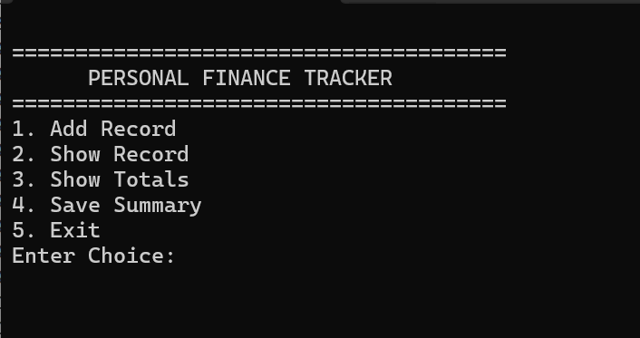
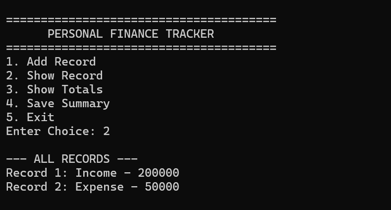
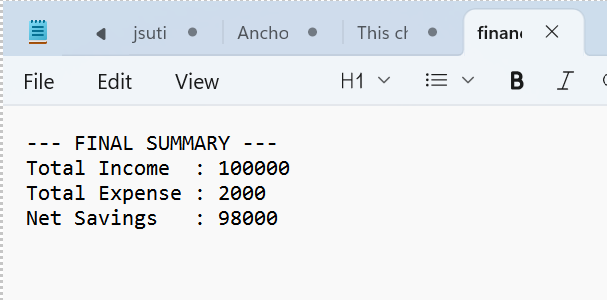

# Personal Finance Tracker

A lightweight, terminal-based Personal Finance Tracker application written in C++. It provides an efficient way to log individual financial transactions, compute dynamic aggregates, and persist data using local file handling.

---

## 🚀 Features

* **Structured Memory Storage:** Uses nested structures (`Record` and `Finance`) to maintain a localized in-memory database of transactions.
* **Dual-Category Entry:** Supports precise categorization between transactional **Income** and **Expense** streams.
* **On-Demand Financial Auditing:** Dynamically calculates total revenue streams, expenditures, and net liquid savings metrics at runtime.
* **Persistent Summary Reports:** Utilizes output file streams (`ofstream`) to serialize and overwrite your financial summary report directly into a clean storage format (`financetracker.txt`).

---

## 🛠️ System Architecture

### Data Layout & Flow
* **`Record` (Data Node):** Implements a primitive-driven payload carrying an integer token identifier (`1` for Income, `2` for Expense) along with a floating-point amount value.
* **`Finance` (Collection Layer):** Manages a static block array capped tightly at an execution boundary limit of 50 items, using a pointer index `count` to maintain chronological transaction alignments.

---

## 📸 Application Walkthrough & Output

### 1. Main Interactive Dashboard
When executed, the program presents an immediate utility landing deck mapping numeric key prompts cleanly to individual accounting tools.



### 2. View Active Financial Records
Choosing the tracking operations allows users to quickly review every recorded entry before committing the aggregated values to deep storage.



### 3. File Serialization Report
The saving sequence exports transient operational memory metrics into a final, human-readable file structure on disk.



---

## 💻 How To Run

1. **Clone the repository:**
   ```bash
   git clone [https://github.com/YOUR_USERNAME/personal-finance-tracker.git](https://github.com/YOUR_USERNAME/personal-finance-tracker.git)
   cd personal-finance-tracker